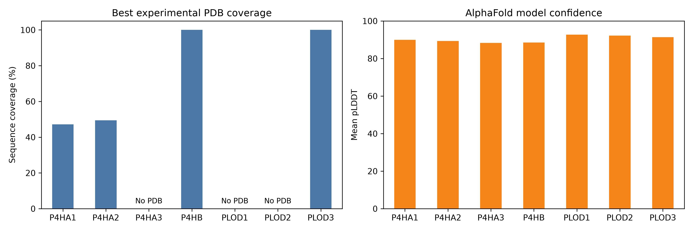

## Comparing experimentally determined collagen-hydroxylation enzymes from PDBe with AlphaFold-predicted structures.

## Biological background
There are serveral enzymes involved in the collagen-hydroxylation proccess. Their contribution is essential to maintain the triple helix structure collgaen is characterized by. This study is based on comparing their experimentally determined structures with ALphaFold 2's prediction of the same hydroxylation enzymes.

## Scope and claim boundaries 
The analysis compared seven proteins from the protein data bank (PDBe). Therefore the results cannot give general conclusions of AlphaFold 2's prediction accuracy. Also, the study compares sequence coverage with mean pLLDT, it is not directly correlated with eachother. Still it came with interesting conclusions. The results gave some structures that were not determined in PDBe. This can be due to the API's not finding the spesific enzyme. It does not have to mean that the enzyme has not yet been experimentally determined.

## Computational workflow
With Jupyter, the study used API-integrations to combine databases from PDBe and AlphaFold 2. Creating CSV-files with relevant data such as enzyme gene name and correct organism.

## Results 

As you can see not all proteins had experimentally proven structures, also not the full sequence coverage was determined. AlphaFold 2 predictions where stable in a mean pLDDT of 96. By this small study, we see that AlphaFold 2 can be a great tool for determing structures. Given that experimentally determined structures is accepted to have a mean pLDDT of atleast 90. In this case, AlphaFold 2 surpasses that comfortably. 
